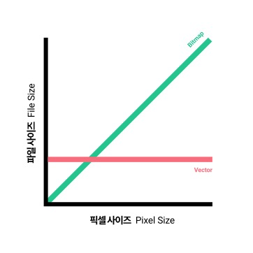

# UI

<details>
<summary>Boilerplate</summary>
<div markdown="1">

# 프로젝트 세팅

## 1. 설치 플러그인

| Plugin       | URL                                                                    |
| ------------ | ---------------------------------------------------------------------- |
| 1. 설치파일  |
| Figma        | https://www.figma.com/downloads/                                       |
| VSCode       | https://code.visualstudio.com/download                                 |
| Figma시안    | https://drive.google.com/file/d/1OJuWQ8UnZZv8GEmA5ihhqbgVBhrHoxAh/view |
| Git          | https://git-scm.com/downloads                                          |
| Git 설치방법 | https://www.youtube.com/watch?v=JKT9laOAPIs                            |

## 2. 익스텐션

- scss-lint
- Live Server
- Gitmoji
- Framer Syntax2
- Material Icon Theme

## 3. 노드설치

- Node LTS 버전
  - Long Term Support : 장기 지원 버전
  - 큰 버그 없이 무난하게 안정적으로 사용할 수 있는 버전
  - 반대로 Current Version 또는 Latest Versiont(=최신버전)
  - 따라서 Latest LTS Version(=최신 장기 지원 버전)을 권장
  - https://www.youtube.com/watch?v=AZPm7tdoQFE
  - https://www.youtube.com/watch?v=rLhPHi10uWk
- node-sass 설치
  - https://www.npmjs.com/package/node-sass
  - 옵션
    - -w: scss 실시간 코드 변경 감지
    - -r: 다중파일 감지

```sh
// 01) packge.json 파일 생성(필요한 노드모듈 다운받고 사용가능한 파일)
npm init -y

// 02) node-sass 설치(node_modules, dependencies:node-sass, package-lock.json)
npm i node-sass

// 03) (package.json)
script > "node-sass": "node-sass"

// 04) node-sass 실행
npm run node-sass

// 05) sass파일을 css파일로 변환 설정(package.json)
script > "sass": "node-sass <input> <output>"
  >  "sass": "node-sass styles/main.scss ./style.css"

// 06) 스크립트 실행(sass → css 변환)
npm run sass

// 07) 스크립트 옵션 추가(package.json)
script > "sass": "node-sass [options] <input> <output>"
  >  "sass": "node-sass -w -r styles/main.scss ./style.css"
  or  "sass": "node-sass -wr styles/main.scss ./style.css"
```

## 4. linter 설정

### 1) SCSS lint

- 일관성 있게 코드를 작성할 수 있도록 도와주는 도구
- 문법적인 실수나 정의한 규칙에 어긋날 경우 자동으로 수정(Automatic Fix)할 수 있게 함
- 익스텐션 scss-lint가 .scss-lint.yml의 규칙대로 코드가 쓰일 수 있도록 도와줌

※ Github > your gist: 코드 단위를 저장할 수 있는 곳으로 자주사용하는 설정이나 코드를 저장할 수 있음

### 2) Prittier lint

- .prettierrc 파일 생성
- VS Code Settings(ctrl + ,)
  - 검색어: format on save > Editor: Format On Save > 체크
  - 검색처: prettier config > Prettier: Require Config > 체크
- Open Setting JSON 설정
  - VS Code Settings > 문서아이콘(Open Settings)
  - "editor.defaultFormatter": "esbenp.prettier-vscode"

</div>
</details>

<details>
<summary>Asset</summary>
<div markdown="1">

# Sass 개요

- Syntactically awesome stylesheet
- CSS Preprocessor: Sass, less, PostCss, stylus 등 CSS의 문제점들을 Programmatically 한 방식
- Sass와 SCSS는 문법의 차이며 같은 회사에서 css 전처리기로 해석되어 css로 컴파일되는 스크립트 언어
- SCSS는 Sass의 3버전에서 등장한 언어이며 퍼블리셔에게 익숙한 css와 비슷한 구문을 가지고 있으며 Sass 기능을 지원하되, css와 거의 같은 문법으로 사용된다는 점에서 퍼블리셔에게 각광받는 언어

# HTML Document 셋업

- html lang="ko" : 한국어
- meta content="width=device-width : 반응형 가능

# 이미지

- vector image : 일러스트 = svg 파일로 권장
- raster image : 픽셀기반 = jpg, png 등

  1. jpg

  - 투명배경 지원하지 않음
  - 파일 압축이 잘 되어 용량이 낮음 → 퍼포먼스에 좋음
  - 그러나 많이 압축되어 있다는 것은 이미지의 퀄리티가 상대적으로 낮음

  2. png

  - 투명배경 지원함
  - 퀄리티 로스가 별로 없지만 용량이 큼

  3. webp

  - 구글에서 제작한 웹을 위한 이미지포맷
  - png보다 26% 적은 용량과 jpg보다 25~34% 덜 손상
  - png와 jpg 장점을 섞음
  - 그러나 현재 많은 보급이 되지 않고 구형 브라우저는 wepb를 지원하지 않음

- 구글 통계상 하나의 웹사이트 리소스 중 용량의 60~65%가 이미지 파일이 차지
- 이미지가 많을 경우 로드되는데 시간이 많이 걸림(=사용성이 좋지 않음)
- 프론트엔드 개발자는 퍼포먼스에 해가 되지 않는 이미지파일을 적절하게 사용해야 사용자 경험이 올라감
- 퍼포먼스를 우선시 할 것인지, 퀄리티를 우선시할 것인지 판단을 해야 함(apple.com 등 잘 만들어진 웹서비스를 참고)
- 아이콘 같이 사이즈가 얼마가 되든 간에 깨끗한 화질을 원하는 이미지는 svg으로 export, png나 jpg로 할 경우는 필셀화(비트맵이미지)되어 버림
- 작은 사이즈를 할 것이라면 = bitmap
- 큰 사이즈를 할 것이라면 = svg
- 대개 logo, icon 등은 svg(단, ie 6,7,8을 응대한다면 해당안됨)



</div>
</details>
